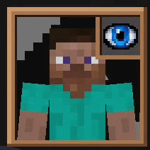
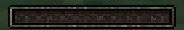
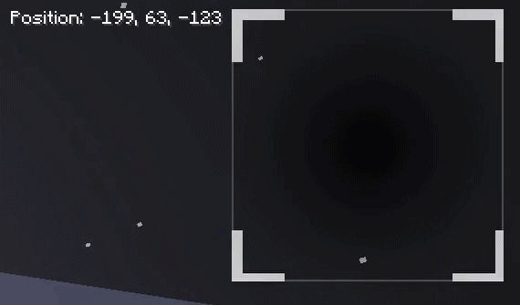
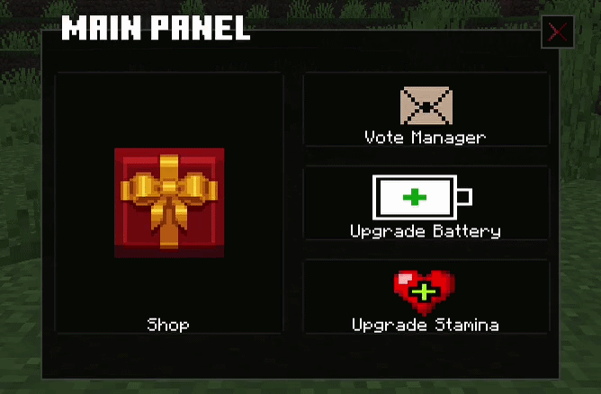

# Inside the Cage ⛓️

> *Developed by i-bexx — Bedrock Add-On Developer & Software Engineering Student*

An advanced, server-side Minecraft Bedrock Add-on that introduces complex survival, psychological horror mechanics, and highly customized JSON UI systems using the **Minecraft Script API**.

🚧 **Status: In Active Development — Core systems complete**
🛑 **Project Scope:** This is a *World-Specific Addon* designed exclusively for a custom-built adventure map. It heavily modifies core engine rules and is not intended for standard procedural survival generation.

---

## 🛠️ Tech Stack

`Minecraft Script API` · `JSON UI` · `JavaScript` · `Bedrock Add-On` · `Custom Geo Models` · `Frame Animation`

---

## 📁 Project Structure

```
inside-the-cage-addon/
├── behavior_pack/      # Entity behaviors, scripts, game logic
├── resource_pack/      # UI, textures, geo models, animations
├── assets/gifs/        # README preview GIFs
├── .gitignore
├── LICENSE
└── README.md
```

---

## 💡 Technical Highlights (Under the Hood)
This project bypasses standard engine limitations by heavily utilizing advanced Bedrock JSON UI scripting and server-side logic:

* **Live 3D UI Rendering:** Implementation of the `live_player_renderer` component to display a real-time, interactive 3D model of the player directly inside a 2D HUD frame.
* **Scope Resolution & Reactive UI:** Custom implementation of sibling scope targeting (`resolve_sibling_scope`) to create reactive UI elements without redundant server-side scoreboard queries.
* **Dual-State UI Synchronization:** Utilizing baseline engine globals (e.g., `#hud_title_text_string`) as data carriers to seamlessly synchronize multiple UI components—such as the dynamic Eye texture and Sanity text.
* **Custom Animations:** Frame-by-frame UI animations and VHS-style glitch effects integrated directly into the HUD panels.

---

## 🎮 Core Gameplay Mechanics

### 🏃 Custom Stamina & Movement
A fully server-side stamina system to enhance survival tension:
* Running for extended periods drains stamina.
* Exhaustion triggers a severe movement speed penalty.
* Players must actively manage their pacing, stopping to rest and recover stamina.

### 📸 Camera Overlay & Sanity System (Line-of-Sight)
A mysterious entity roams the map, governed by custom Line-of-Sight (LoS) detection and dynamic teleportation.
* **Camera Mechanics:** Players utilize a custom camera item that opens a realistic overlay (built via custom `geo.json` models).
* **Sanity Drain:** Looking directly at the stalker entity drains Sanity rapidly.
* **Psychological Effects:** Approaching danger triggers screen shaking and static UI effects. Reaching 0 Sanity teleports the player to a dark dimension featuring a custom animated "Game Over" screen.


### 🖥️ Custom HUD Implementation
A fully responsive user interface:
* **Top Left (Sanity & Player Model):** A custom wooden frame housing a live 3D player model. Features a Dual-Feedback Sanity System.



* **Bottom Middle:** Fully animated Stamina Bar.




* **Top Right:** Dynamic compass and coordinates. *(Survival Twist: Coordinates are forcefully disabled mid-round, triggering VHS-style "position lost" visual glitches).*




* **Bottom Right:** Real-time coin balance.

### 💰 Economy & Objectives
* **Shop System:** Coins spawn across the map. Players can use the Compass Item to spend these coins to upgrade their stamina and battery capacity, or to purchase goods such as a survival kit or weapons and ammo (Pistol, Knife, Toxic Bomb).



* **Win Condition:** 7 custom lantern entities spawn at predefined locations. Players must find and break them to release the trapped blue souls to secure a win.
* **Combat:** As rounds progress, hostile entities dynamically spawn and hunt the player, requiring active use of the purchased arsenal.

---

## 📥 Downloads & Support
Once a stable playable build is finalized, I will be providing:
* Free Downloads for the public Bedrock community.
* Patreon Early Access for supporters to test new mechanics and updates before public release.

*Stay tuned for updates!*

---

**⚖️ Legal Disclaimer:** *This project is an independent community creation for Minecraft Bedrock Edition and contains modified versions of original game UI code structures (e.g., `server_form.json`). (c) Mojang AB and (c) Microsoft Corporation. All rights reserved for the original game assets and baseline code structures. It is not an official Minecraft product and is not approved by or associated with Mojang or Microsoft.*
