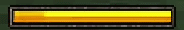

# Inside the Cage ⛓️

> *Developed by i-bexx — Bedrock Add-On Developer & Software Engineering Student*

An advanced, server-side Minecraft Bedrock Add-On featuring complex survival mechanics, psychological horror systems, and highly customized JSON UI — built with the **Minecraft Script API (`@minecraft/server`)**.

🚧 **Status:** In Active Development — Core systems complete  
🛑 **Project Scope:** World-Specific Adventure Map Addon — introduces custom survival mechanics and heavily modifies vanilla UI.

---

## 🛠️ Tech Stack

`Minecraft Script API` · `JSON UI` · `JavaScript (ES6+)` · `Molang` · `Bedrock Entity System` · `Custom Geo Models` · `Blockbench` · `Animation Controllers` · `Render Controllers` · `Particle Effects`

---

## 📁 Project Structure

```
inside-the-cage-addon/
├── behavior_pack/
│   ├── scripts/              # 30+ modular JS files (Script API)
│   │   ├── Player/           # Join/leave logic, per-player state
│   │   ├── RoundBegin/       # Sanity, stamina, battery, cage, coin systems
│   │   ├── RoundOperations/  # Round lifecycle management
│   │   └── UI/               # HUD tick controllers (fast/slow)
│   ├── entities/             # 13 custom entity definitions
│   ├── items/                # Custom weapons, tools, battery items
│   ├── animation_controllers/# Gun, hostile, player state machines
│   ├── animations/           # Entity & item behavior animations
│   └── recipes/              # Crafting recipes
│
├── resource_pack/
│   ├── ui/                   # 47 custom JSON UI files
│   │   ├── server_form_panels/  # Factory-pattern server form system
│   │   ├── main_screen/         # HUD components (sanity, stamina, compass)
│   │   └── navigation/          # Compass & coordinate displays
│   ├── entity/               # 16 client-side entity definitions
│   ├── models/               # Custom geo models (Blockbench)
│   ├── animations/           # Client-side animations
│   ├── animation_controllers/# Client-side animation controllers
│   ├── render_controllers/   # 3 conditional render controllers
│   ├── particles/            # 8 custom particle effects
│   ├── attachables/          # 5 attachables (gun, knife, kit, ammo, toxic bomb)
│   └── materials/            # Custom entity materials
│
├── .gitignore
├── LICENSE
└── README.md
```

---

## 🔧 Entity Logic & Molang

This project relies heavily on **custom entity definitions** and **Molang expressions** to drive gameplay:

### Custom Entities
| Entity | Description | Key Components |
|--------|-------------|----------------|
| `minecraft:player` (modified) | 20+ component groups, 30+ events for cursor state, shooting, static effects, battery, movement control | `mark_variant`, `skin_id`, `variant`, `type_family`, `movement` |
| `game:stalker_cursor` | Per-player invisible tracker entity — follows player's line-of-sight via Script API raycast | Scoreboard-based hash matching for multiplayer sync |
| `game:hostile` | Dynamic enemy with hunt/patrol AI, death animation states | `navigation.walk`, `behavior.nearest_attackable_target`, conditional animations |
| `game:cage` | Interactable cage entity with broken/unbroken states | `mark_variant` state switching via events |
| `game:coin` / `game:battery` / `game:bottle` | Collectible items with pickup detection | `interact` component + Script API event handlers |
| `game:door` | State-driven door with host-waiting and open states | Multi-state `mark_variant` event system |
| `game:null` | Slenderman-style stalker entity — constantly follows player and triggers rapid sanity drain when looked at | Line-of-sight detection & proximity tracking |
| `game:password_label` | Static visual text entity | Displays the password to the player |
| `game:random_peep` | Story-driven interactive NPC | `interact` → Script API panel routing |
| `menu:new_game` / `menu:continue` | Interactive menu system entities | Used for main menu state routing |
| `game:teleporter` | Multi-destination teleport pads | Scoreboard-indexed destination mapping |

### Molang Usage
- **Conditional rendering:** `q.variant`, `q.mark_variant`, and `q.skin_id` used across render controllers to dynamically switch textures based on game state.
- **Animation conditions:** `q.is_item_equipped`, `q.get_equipped_item_name` for weapon-specific animation triggers.
- **Math expressions:** `math.floor`, `math.mod` for frame-based UI animations.

---

## 🎬 Animations & Animation Controllers

### Behavior Pack Animation Controllers (State Machines)
Complex state machines drive player and entity behaviors:

- **Gun System** (`controller.animation.gun`): Multi-state weapon logic — `idle → draw → aim → shoot → not_shooting` with Molang-driven transitions based on `q.variant` and `q.mark_variant`.
- **Ammo System** (`controller.animation.gun_no_ammo`, `controller.animation.ammo_reload`): Handles empty magazine detection, reload animations, and HUD feedback.
- **Toxic Bomb** (`controller.animation.toxic_bomb`): Deployable area-of-effect weapon with `q.is_item_equipped` gating.
- **Kit System** (`controller.animation.kit`): Item-use detection via `query.is_using_item` to trigger behavior-pack animations.
- **Camera Static Effects** (`controller.animation.camera_no_signal`, `controller.animation.used_cam_when_could`): Sanity-driven VHS noise and signal loss effects.
- **Hostile AI** (`controller.animation.hostile`): Patrol → chase → attack state transitions.

### Behavior Pack Animations
Animations executed server-side through `/execute`, `playsound`, `camerashake`, and `particle` commands — tightly synchronized with Script API state changes.

### Resource Pack Animations
- Frame-by-frame flipbook animations for UI elements (weapon hitmarkers on hostile entities).
- Player bone animations for weapon draw/aim/shoot cycles.
- VHS glitch and static noise screen effects.

---

## 🖌️ Render Controllers

Three custom render controllers handle **conditional texture switching** based on entity state:

| Controller | Purpose | Molang Logic |
|-----------|---------|------|
| `controller.render.hostile` | Core render controller for hostile entity | Binds geometry and default materials/textures |
| `controller.render.stalker_cursor` | Per-player cursor color system (normal/green/blue/red) | `q.skin_id` index mapping |

---

## 🖥️ Script API Architecture (`@minecraft/server`)

### Modular Codebase — 30+ Files
The entire game loop is driven by a **modular JavaScript architecture** with clean separation of concerns:

- **Reactive State Management:** `Proxy`-based state objects that automatically trigger game events when properties change (used in battery, cursor, stalker, and game state systems).
- **Per-Player Memory Tracking:** `Map()` objects for individual player states — stamina cooldowns, sanity thresholds, shooting states, compass directions — with proper cleanup on disconnect.
- **Timer/Interval Management:** `system.runInterval` and `system.runTimeout` IDs are tracked and properly cleaned via `system.clearRun()` to prevent memory leaks.
- **Centralized Scoreboard API:** Abstracted scoreboard access through `scoreboards.js` module with null-safe getters.
- **Entity-Script Bridge:** Script API controls entity states via `triggerEvent()`, while entity animation controllers execute commands that feed data back to scripts — creating a seamless two-way communication layer.

### Key Systems
| System | File(s) | Description |
|--------|---------|-------------|
| Game Loop | `gameStats.js` | Round management, win/lose conditions, player tracking |
| Sanity | `Sanity.js`, `playerLooking.js` | Line-of-sight detection → sanity drain → heart/static effects |
| Stamina | `Stamina.js`, `fastUiTick.js` | Sprint detection → stamina drain → movement penalty |
| Battery | `batteryController.js` | 5-level battery drain with upgrade system and critical warnings |
| Stalker | `stalkerEntity.js`, `cursorController.js` | Per-player entity spawning with hash-based scoreboard matching |
| Camera | `cameraUsage.js`, `cameraController.js` | Custom camera overlay with state machine integration |
| Economy | `coinController.js`, `Buy.js`, `panels.js` | Coin collection, shop system with discount ticket |
| Voting | `voteManager.js` | Multiplayer consensus system for cutscene skipping |
| UI Sync | `fastUiTick.js`, `slowUiTick.js` | Dual-speed HUD update system |

---

## 🎨 JSON UI System (47 Custom Files)

A completely custom UI layer built on top of Minecraft's vanilla JSON UI engine:

- **Server Form Factory Pattern:** Modified `server_form.json` with `control_ids` routing to dynamically switch between `long_form` and `custom_form` panels based on `#title_text` data.
- **Dual-State HUD Synchronization:** Engine globals (`#hud_title_text_string`) used as data carriers to synchronize custom UI components without redundant scoreboard queries.
- **Live 3D Player Renderer:** `live_player_renderer` component embedded inside a custom wooden frame HUD element.
- **Scope Resolution:** Custom `resolve_sibling_scope` implementation for reactive UI updates.
- **Custom Animations:** VHS glitch, compass rotation, and stamina bar animations — all driven through JSON UI.
- **Vanilla Toast Hijacking:** Repurposed Minecraft's hardcoded recipe-unlock notifications to display custom in-game alerts.
- **Interactive Action Forms:** State-driven NPC dialogue panels and real-time radar displays built on top of `ActionFormData`.
- **Vanilla UI Override:** Complete inventory and interaction menu overhaul via `ui_common.json`.

---

## 🎮 Core Gameplay Mechanics

### 🏃 Stamina & Movement
* Server-side stamina with sprint detection and movement speed penalties.
* Upgradeable stamina capacity through the shop system.

### 📸 Camera & Sanity (Line-of-Sight)
* Custom camera item with geo model overlay.
* Stalker entity with per-player raycast tracking.
* Sanity drain triggers progressive VHS static, screen shake, and heart pounding effects.
* 0 Sanity = animated "Game Over" title.


### 🖥️ Custom HUD
* **Top Left:** Live 3D player model in wooden frame + dual-feedback sanity display.


* **Bottom Middle:** Animated stamina bar with fill/deplete transitions.




* **Top Right:** 32-frame compass + VHS "position lost" glitch effect.


### 💰 Economy & Combat
* Coin collection with compass-based shop (upgrades, weapons, consumables).
* Combat with pistol, knife, and toxic bomb — each with custom attachable models and animations.
* 7 cage entities to find and break to win, aided by a custom Cage Detector tool with real-time distance, signal, and ETA display.


> 🔬 **Want to see more?** This README only scratches the surface. See how I reverse-engineered Minecraft's hardcoded UI to build a [real-time radar system, interactive dialogue engine, and custom notification framework →](./docs/ADVANCED_UI.md)

---

## 📥 Downloads & Support
Once a stable playable build is finalized, I will be providing:
* Free Downloads for the public Bedrock community.
* Patreon Early Access for supporters.

*Stay tuned for updates!*

---

**⚖️ Legal Disclaimer:** *This project is an independent community creation for Minecraft Bedrock Edition and contains modified versions of original game UI code structures (e.g., `server_form.json`). (c) Mojang AB and (c) Microsoft Corporation. All rights reserved for the original game assets and baseline code structures. It is not an official Minecraft product and is not approved by or associated with Mojang or Microsoft.*
