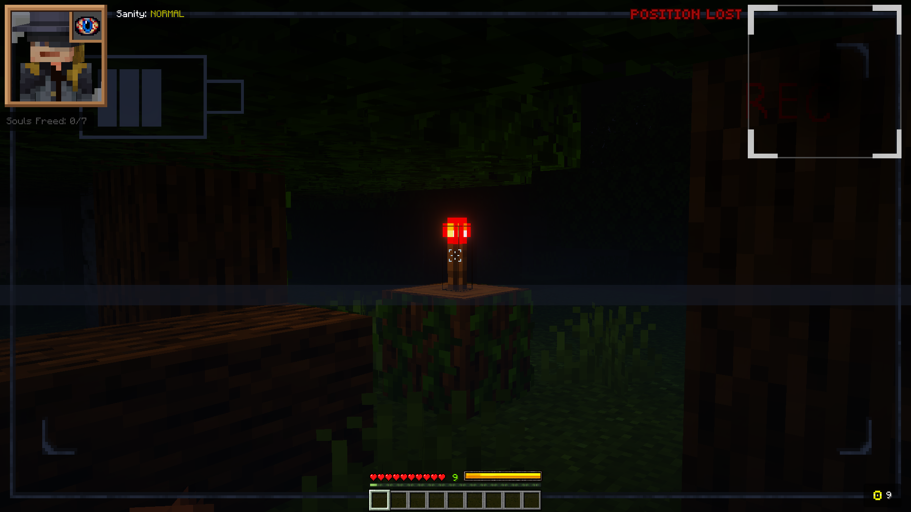
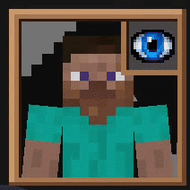
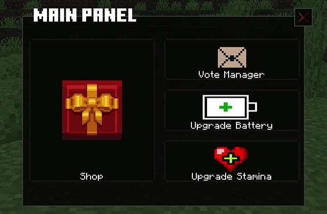
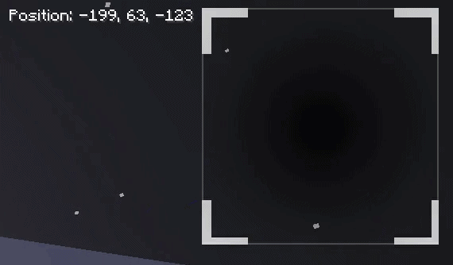
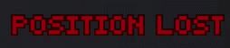

# Inside the Cage ⛓️

> **Developed by [i-bexx](https://github.com/i-bexx)** — Software Engineering Student & Minecraft Bedrock Add-On Developer  
> 📧 yigitkarabacak364@gmail.com

**Inside the Cage** is a complex, server-side Minecraft Bedrock Add-On built primarily with the **Minecraft Script API**.

## 📊 Project at a Glance

| Metric | Value |
|--------|------:|
| Script API Modules | 30+ |
| JSON UI Files | 40 |
| Custom Entities | 13 |
| Animation Controllers | 10+ |
| Custom Particle Effects | 8 |

  
   
  <i>Full custom HUD featuring dynamic tracking, live stamina, and animated overlays.</i>

---

## 🛠️ Core Technologies

`JavaScript (ES6+)` · `Minecraft Script API` · `JSON UI` · `Molang` · `Event-Driven Architecture` · `State Machines` · `Blockbench`

---

## 🏗️ Architecture & System Design

### Modular Codebase

The core game loop is managed through 30+ modular JavaScript modules with a strict separation of concerns, enabling maintainable and scalable gameplay systems.

- **Per-Player Memory Isolation:** Utilized `Map()` objects to maintain isolated player state. Player disconnect event triggers cleanup of all associated references, preventing stale state and memory growth during long-running multiplayer sessions.
- **Entity-Script Bridge:** A seamless two-way communication layer where the Script API drives entity states via `triggerEvent()`, while entity Animation Controllers execute commands that feed telemetry back to the scripts.

### User Interface

Minecraft Bedrock exposes no official runtime UI API. To overcome this limitation, the project modifies the vanilla JSON UI framework to build a dynamic, real-time interface system.

- **Server Form Routing:** Modified vanilla `server_form.json` elements to act as a dynamic router, switching between panels based on injected string data.
- **Vanilla Notification Hijacking:** Repurposed the engine's hardcoded "recipe unlock" toast notifications. By modifying scope resolution (`resolve_sibling_scope`), the system displays custom in-game alerts (e.g., "Coin Bag is Full").
- **Live 3D Rendering:** Embedded `live_player_renderer` components within custom HUD frames, synchronized with global engine variables (`#hud_title_text_string`) to update without redundant server-side polling.

---

## 📸 Visual Showcase

<table>
  <tr>
    <td align="center"><b>Live 3D HUD & Sanity Feedback</b> </td>
    <td align="center"><b>Main Panel Section</b> </td>
  </tr>
  <tr>
    <td align="center"><b>Compass Panel & Coordinates</b> </td>
    <td align="center"><b>Position Lost Text</b> </td>
  </tr>
</table>

---

## 📚 Detailed Documentation

For deeper technical discussions, refer to the following documentation:

- 🔬 **[Advanced UI Systems](./docs/ADVANCED_UI.md):** Interactive dialogue engines, radar logic, and toast hijacking.
- ⚙️ **[Entity Systems & Molang](./docs/ENTITY_SYSTEMS.md):** Custom entity components, render controllers, and conditional Molang expressions.
- 🎬 **[Animation State Machines](./docs/ANIMATION_STATE_MACHINES.md):** Weapon systems, transitions, and behavior-pack animation logic.
- 🎮 **[Gameplay Mechanics](./docs/GAMEPLAY_MECHANICS.md):** Overview of the survival, horror, and progression systems.

---

## 📥 Current Status & Availability

This project is currently in **active development** and is published primarily as a portfolio and technical showcase.

A compiled, playable `.mcpack` release will be made publicly available once development reaches a stable milestone.

---

**⚖️ Legal Disclaimer:** *This project is an independent community creation for Minecraft Bedrock Edition and contains modified versions of original game UI code structures (e.g., `server_form.json`). © Mojang AB and © Microsoft Corporation. All rights reserved for the original game assets and baseline code structures. It is not an official Minecraft product and is not approved by or associated with Mojang or Microsoft.*