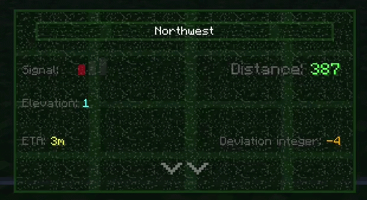
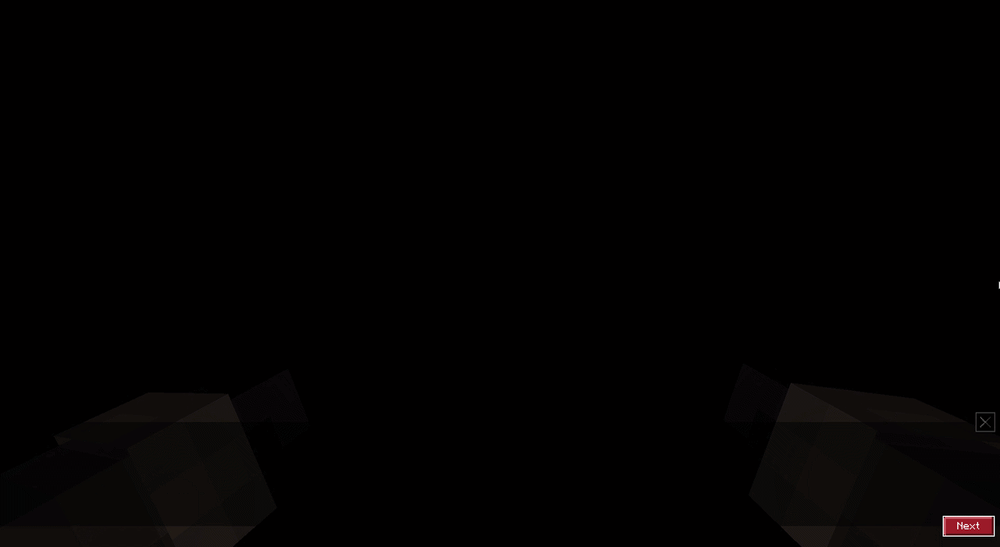

# 🔬 Advanced UI Systems — Deep Dive

> Beyond the HUD elements shown in the main README, this project includes several advanced UI systems.

*← Back to [Main README](../README.md)*

---

## 📡 Cage Detector — Real-Time Radar Panel

A custom handheld scanning tool that locates hidden cage entities and displays live tracking data through a fully custom UI panel.

- Calculates **3D Euclidean distance**, compass direction, elevation difference, and estimated walking time (ETA) to the nearest unbroken cage
- Renders a **dynamic signal strength icon** (low/normal/high) based on distance thresholds
- Adds a **deviation integer** to coordinates — the readings are intentionally imprecise, adding gameplay tension
- Background features a **3-phase static noise animation** — three noise textures flickering at different intervals, creating a "scanning radar" aesthetic

⚙️ How it works under the hood

 
Script API computes all spatial data → injects it into <code>ActionFormData</code> as button labels and textures → <code>server_form.json</code> routes the form to a custom panel → JSON UI renders each value via <code>collection_index</code> bindings with inline color formatting (<code>§8Distance: §a{value}</code>).

---

## 💬 Random Peep — Interactive Dialogue Engine

A multi-scene NPC conversation system with branching choices and persistent state — built entirely on `ActionFormData` and custom JSON UI.

- **3-act dialogue flow:** Introduction → moral choice (help or refuse) → consequence
- Choosing "Yes" triggers an entity animation — the NPC visually stands up from a sick pose, creating a narrative payoff
- NPC **remembers your choice** via entity dynamic properties — revisiting gives different dialogue based on whether you helped
- **Multiplayer-safe:** Prevents concurrent conversations with a lock flag
- Text reveals with a **typewriter animation** — a clip-based effect that progressively reveals each line from left to right

⚙️ How it works under the hood

 
The JSON UI panel switches between 3 container modes (<code>conversation_part</code>, <code>question_part</code>, <code>farewell_part</code>) using <code>#form_text</code> body data as a visibility toggle. Each mode has its own layout — grids for dialogue lines, split buttons for yes/no choices.

---

## 🔔 Toast Screen — Vanilla Notification Hijacking

A technique that repurposes Minecraft's **hardcoded recipe-unlock toast** to display custom in-game alerts — something Bedrock provides no official API for.

- Displays a custom "Coin bag is now full!" notification using the vanilla toast popup system
- Works on both Classic (desktop) and Pocket (mobile) UI modes

⚙️ How it works under the hood

 
The vanilla toast <code>input_panel</code> is removed via JSON UI <code>modifications</code>. A hidden <code>item_renderer</code> is injected that watches for a specific item ID. When that recipe unlocks, a custom panel becomes visible via <code>resolve_sibling_scope</code> — effectively hijacking the notification to show custom content instead.

---

*← Back to [Main README](../README.md)*
