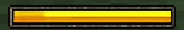
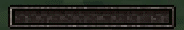

# 🎮 Core Gameplay Mechanics

*← Back to [Main README](../README.md)*

This document outlines the user-facing gameplay features implemented via the addon's core architecture.

## 🏃 Stamina & Movement
The game utilizes a custom server-side stamina system. It detects when players sprint and applies movement speed penalties accordingly when stamina depletes. The player's total stamina capacity is upgradeable through the in-game shop system.

<table>
  <tr>
    <td align="center"><b>Stamina Depletion</b> </td>
    <td align="center"><b>Stamina Regeneration</b> </td>
  </tr>
</table>

## 📸 Camera & Sanity (Line-of-Sight)
Players are equipped with a custom camera item that applies a geo-model overlay to the screen. 

  

- **Sanity Drain:** Looking at the stalker triggers a progressive sanity drain. This is visually represented by VHS static overlays, screen shake, and heart-pounding audio effects.
- Reaching 0 Sanity results in an animated "Game Over" sequence.

  

## 💰 Economy & Combat
- **Economy:** Players collect coins which can be used in shop system to purchase upgrades, weapons, and consumables.
- **Combat:** Features a fully animated combat system with a pistol, combat knife, and toxic bombs—each utilizing custom attachable models and bone animations.
- **Objective:** The core objective requires players to locate 7 cage entities and break them.
